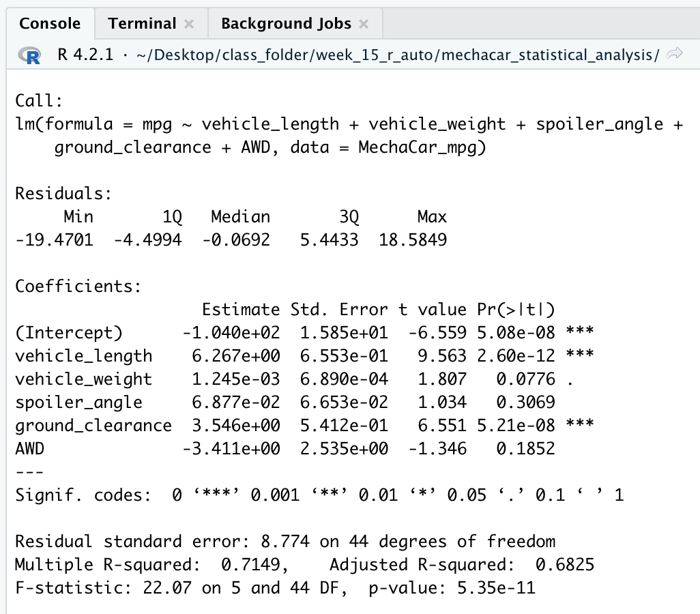
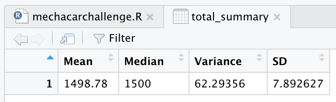
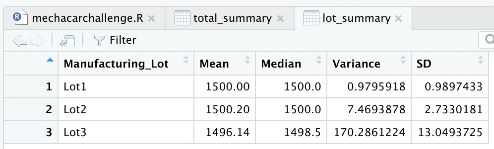
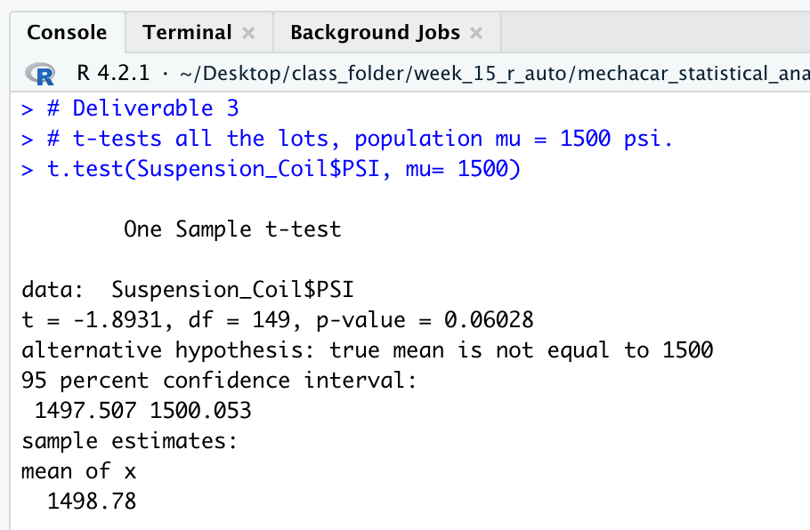
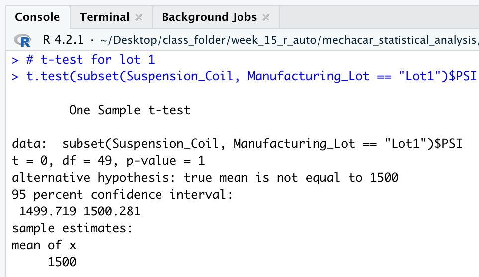
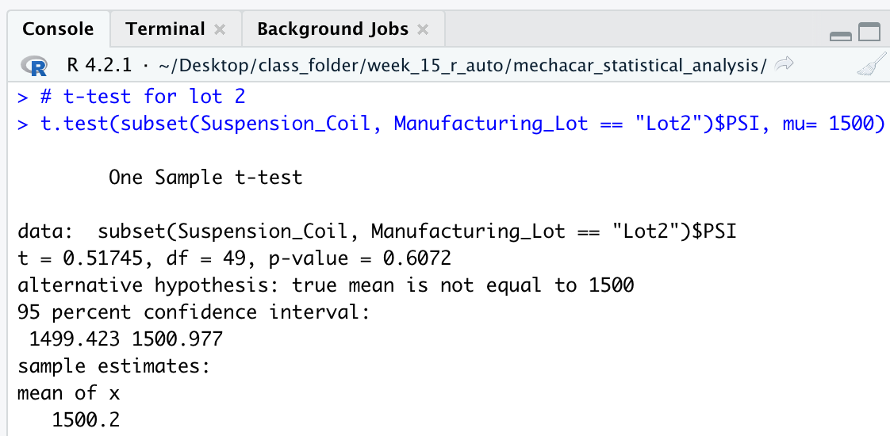
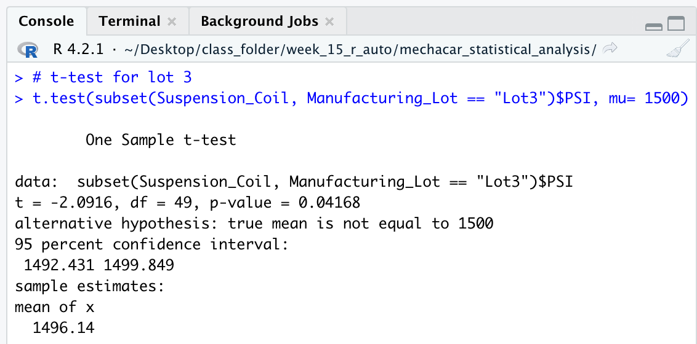

# mechacar_statistical_analysis

## Overview of Project

The purpose of this project is to perform a statistical for AutosRUs’ new MechaCar which is “suffering from production troubles” and the company is hoping for insight from an analytical review, using R and RStudio. 
The goal of this project was to :
* Determine which variables predict the MPG for vehicle prototypes;
* Collect summary statistics on the PSI of suspension coils;
* Discover if the manufacturing lots are statistically different from the mean population;
* Plan a study to compare the MechaCar’s performance versus vehicles from other manufactures. 

---

## Resource:

Data Sources: MechaCar_mpg.csv, Suspension_Coil.csv.

Tools: R, RStudio, Visual Studio Code, dplyr,Tidyverse, ggplot2.
 
---

## Results:

## Linear Regression to Predict MPG:

**Linear Regression**

The linear regression was calculated using R in RStudio, the data source MechaCar_mpg.csv contains a sample size of 50 prototypes measuring the MPG or miles per gallon across several variables. The below coefficients were found by applying the R script to the dataset on multiple variables. 

_funct.png)

The most significant variables in the dataset that provided a non-random amount of variance to the mpg values was Ground Clearance and Vehicle Length. The slope of the linear model cannot be zero, with a p-value of 5.35x10-11. Converting the coefficients from scientific notation, vehicle length: 6.267, vehicle weight: 0.001, spoiler angle: 0.069, ground clearance: 3.546, AWD: -3.411. All the variable’s slopes were shown to be non-zero with a few close to zero, this results in a non-zero slope and rejection of the null hypothesis (H0).

This model does predict the mpg of the MechaCar prototype with 71% accuracy as indicated by the r-squared value of 0.7149. However, there may be other variables not considered in the dataset contributing to the variation in the mpg. 

---

## Summary Statistics on Suspension Coils:

The following is the summary statistics for all the manufacturing lots, the population mean was determined to be 1500 and the mean was 1498.78.

The overall variance is under 100 psi and does meet the specifications there is a problem with the variance for Lot 3. Lot 3 is over the acceptable threshold at 170.286, as shown in the Lot Summary above.

---

## T-Tests on Suspension Coils:

**T-Test for all Lots**

The mean is within the 95% confidence interval, the P-value is 0.6028, the alpha is 0.05. The T-Test results for all manufacturing lots shows it is not statistically significant from the normal distribution and normality can be assumed. 

**T-Test for Lot 1**

The mean is within the 95% confidence interval, the P-value is 1, the alpha is 0.05. The T-Test results for Lot 1 shows it is not statistically significant from the normal distribution and normality can be assumed. 

**T-Test for Lot 2**

The mean is within the 95% confidence interval, the P-value is 0.6072, the alpha is 0.05. The T-Test results for Lot 2 shows it is not statistically significant from the normal distribution and normality can be assumed. 

**T-Test for Lot 3**

The mean is within the 95% confidence interval, the P-value is 0.04168, the alpha is 0.05. The T-Test results for Lot 3 shows it is statistically significant from the normal distribution and normality cannot be assumed. 

---

## Summary:

## Study Design: MechaCar vs Competition:

Comparing the MechaCar to its competitors on different metrics would be a great asset to many consumers. Some metrics to study would be cost, city or highway fuel efficiency, horsepower, maintenance cost, or safety rating. 

* What metric or metrics are you going to test?
The next metric to test should be safety rating, maintenance cost, city and highway fuel efficiency. This ought to address some of the concerns the consumers encounter when car shopper.

* What is the null hypothesis or alternative hypothesis?
H0: the mean of the safety rating is zero.
HA: the mean of the safety rating is not zero. 

* What statistical test would you use to test the hypothesis? And why?
To show how the variables impact the safety ratings for the MechaCar and their competitors by using multiple linear regression statistical summary using R and RStudio.

* What data is needed to run the statistical test?
To run the statistical test a random sample of > 30 for the selected variables (safety rating, maintenance cost, city and highway fuel efficiency) would need to be composed for MechaCars and their competitors.

---
